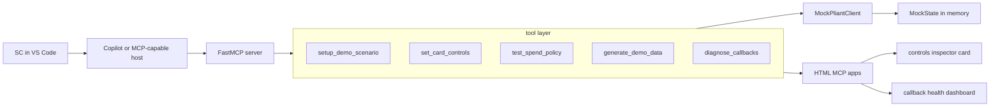

# Pliant Demo Architect MCP

This is an MCP server for: preparing Pliant demo scenarios, configuring spend controls, testing policies in natural language, generating realistic transaction data, and diagnosing callback issues from inside VS Code.

The project is built around the workflow of a Pliant Solution Consultant (SC). Instead of clicking through a sandbox UI before every prospect call, the consultant runs a prompt chain, gets a configured mock environment, and then uses follow-up prompts to test policy edge cases and answer technical webhook questions live.

The current implementation is mock-first. It keeps data in memory, mirrors the real Pliant API shapes where practical, and is designed so a future live client can replace the mock client without changing the tool contract.

## Why this exists

Demo prep is repetitive and fragile:

- Create an organization and card account
- Issue a card to a named cardholder
- Configure categories, time windows, and limits
- Generate transactions so the account does not look empty
- Answer ad hoc questions like "would this spend be blocked?"
- Explain webhook retry behavior when an engineer joins the call

The server turns that workflow into five MCP tools and two inline app views.

## What is implemented

- FastMCP server entry point with five working tools
- In-memory `MockPliantClient` with deterministic IDs and seeded fixture data
- PRD-style MCP app views for card controls and callback diagnostics
- Tool-level payload tests and mock-layer tests
- Copilot skill files for demo prep and policy checking
- Smoke-run script that exercises the end-to-end flow in one process

## Tools

| Tool | Purpose |
|------|---------|
| `setup_demo_scenario` | Create or reuse a deterministic scenario with org, card account, cardholder, and virtual card |
| `set_card_controls` | Apply category, merchant, time, and amount controls to a card |
| `test_spend_policy` | Return structured controls for LLM reasoning and render the controls inspector app |
| `generate_demo_data` | Create realistic transactions, with optional declined attempts |
| `diagnose_callbacks` | Return callback health, failed events, retry strategy, and security guidance |

## Architecture overview



### Design choices

- `MockPliantClient` is the main product path for MVP, not a fallback.
- State is in-memory and scoped to the server process lifetime.
- IDs are deterministic so prompt chains are reproducible.
- The tool output is the source of truth for the LLM. The model reasons over returned data instead of hidden server rules.
- The two UI resources use the `@modelcontextprotocol/ext-apps` SDK and render business-facing cards instead of raw JSON.

## Quick start

Create a local virtual environment and install the project with dev dependencies:

```bash
/usr/bin/python3 -m venv .venv
.venv/bin/python -m pip install -e .[dev]
```

List the registered tools:

```bash
PATH="$PWD/.venv/bin:$PATH" .venv/bin/fastmcp list server.py
```

Run the server over stdio:

```bash
.venv/bin/python server.py
```

Call a single tool through the FastMCP CLI:

```bash
PATH="$PWD/.venv/bin:$PATH" .venv/bin/fastmcp call server.py setup_demo_scenario \
	scenario_name='Smoke Demo' \
	cardholder_name='Alex Example' \
	--json
```

Run the tests:

```bash
.venv/bin/python -m pytest -q tests
```

## Configuration

The server loads `.env` values through `python-dotenv`. Current variables:

```env
PLIANT_MODE=mock
PLIANT_API_KEY=
PLIANT_API_VERSION=2.1.0
PLIANT_BASE_URL_CAAS=https://partner-api.getpliant.com
PLIANT_BASE_URL_PRO=https://customer-api.getpliant.com
```

Only `mock` mode is implemented in MVP.

## Use in VS Code

Add the server to your MCP config:

```json
{
	"servers": {
		"pliant-demo-architect": {
			"command": "/absolute/path/to/pliant-demo-architect-mcp/.venv/bin/python",
			"args": ["server.py"],
			"cwd": "/absolute/path/to/pliant-demo-architect-mcp"
		}
	}
}
```

## Copilot skills

The repo includes two skills under `.github/skills/`:

- `pliant-demo-prep` for end-to-end scenario setup
- `pliant-policy-check` for spend-policy evaluation prompts

These map directly to the two most common SC workflows: pre-call setup and live policy testing.

## Prompt chains

These are the primary demo flows to run during a walkthrough or prospect session.

### Full demo prep

Target: before a prospect call. Produces a configured environment in one prompt chain.

```text
Step 1: "Set up a demo scenario called 'Adidas EU Marketing' with cardholder
				 Anna Schmidt, EUR card, 5000 EUR limit"
				 -> setup_demo_scenario

Step 2: "Add card controls: only ADVERTISING_AND_MARKETING and
				 COMPUTING_AND_SOFTWARE categories, weekdays 08:00-18:00
				 Europe/Berlin, max EUR 2000 per transaction"
				 -> set_card_controls

Step 3: "Generate 8 test transactions -- mix of allowed categories and
				 include 2 blocked attempts"
				 -> generate_demo_data

Step 4: "Test: Can Anna buy a EUR 300 Google Ads subscription on Monday at 10am?"
				 -> test_spend_policy

Step 5: "Test: Can Anna buy a EUR 200 dinner on Friday at 20:00?"
				 -> test_spend_policy
```

Expected outcome:

- one org, card account, cardholder, and card
- controls showing allowed categories, weekday hours, and amount limit
- eight transactions with a mix of confirmed and declined attempts
- one obviously allowed scenario and one obviously blocked scenario

### Technical evaluation

Target: when an engineer asks about webhook reliability.

```text
Step 1: "Show me callback health for the Adidas EU Marketing account"
				 -> diagnose_callbacks

Step 2: "What's the retry strategy for the failed callbacks?"
				 -> LLM answers from retry_strategy

Step 3: "How does signature verification work?"
				 -> LLM answers from security_note
```

### Quick category test

Target: answer a one-off prospect question during the demo.

```text
"Test: Can Anna buy a EUR 500 spa treatment today at 3pm?"
-> test_spend_policy
```

Expected outcome: blocked because `ENTERTAINMENT_AND_WELLNESS` is outside the allowed list.

### Custom prospect scenario

Target: build a tailored scenario on the fly.

```text
Step 1: "Set up a demo for 'FinCorp US Fleet' with cardholder James Chen,
				 USD card, 10000 USD limit"

Step 2: "Set controls: only TRAVEL_AND_ACCOMMODATION,
				 FOOD_AND_DRINKS, and SERVICES. No time restrictions.
				 Max USD 500 per transaction."

Step 3: "Generate 5 fleet-style transactions -- fuel, hotels, meals"

Step 4: "Test: Can James spend USD 600 on a hotel?"

Step 5: "Test: Can James spend USD 150 on lunch on Saturday?"
```

## Smoke run

The mock state lives inside one Python process, so the end-to-end smoke run executes all five tools within a single server process:

```bash
.venv/bin/python scripts/smoke_run.py
```

The script runs:

1. `setup_demo_scenario`
2. `set_card_controls`
3. `generate_demo_data`
4. `test_spend_policy`
5. `diagnose_callbacks`

It prints a compact summary and exits non-zero if any tool returns an error payload.

## Walkthrough and recording guide

This repo is designed to be demoed, not just read. The README should be enough for a viewer to understand the narrative before you start recording.

### Recording setup

- Use VS Code in focus
- Record at 1920x1080 or better
- Keep terminal and chat text at 14pt or larger
- Target 3 to 5 minutes
- No voiceover is required if the prompts and outputs are readable

### Suggested recording script

| Timestamp | Action | What should be visible |
|-----------|--------|------------------------|
| 0:00 | Open the repo and show the README briefly | project framing and tool list |
| 0:15 | Start the full demo prep chain | prompt entered in chat |
| 0:20 | Run `setup_demo_scenario` | created IDs and ready message |
| 0:35 | Run `set_card_controls` | controls payload |
| 0:50 | Run `generate_demo_data` | transaction summary |
| 1:05 | Run allowed scenario | controls inspector app and ALLOWED reasoning |
| 1:30 | Run blocked scenario | controls inspector app and BLOCKED reasoning |
| 2:00 | Switch to technical evaluation | new prompt chain |
| 2:05 | Run `diagnose_callbacks` | callback health dashboard |
| 2:30 | Ask about retry strategy | LLM explanation based on payload |
| 2:50 | Close on repo link or README summary | final framing |

### What a strong walkthrough should prove

- the demo environment is reproducible from prompt chains
- controls are visible and legible in the inline app
- blocked and allowed outcomes are easy to explain
- webhook reliability questions can be handled without leaving the IDE
- the toolchain looks reusable by other SCs, not like a one-off prototype

### Publishing note

The recording itself is not committed in this repo yet. When you produce it, embed or link it from this README.

## Validation

Verified commands:

```bash
PATH="$PWD/.venv/bin:$PATH" .venv/bin/fastmcp list server.py
PATH="$PWD/.venv/bin:$PATH" .venv/bin/fastmcp call server.py setup_demo_scenario \
	scenario_name='Smoke Demo' \
	cardholder_name='Alex Example' \
	--json
.venv/bin/python scripts/smoke_run.py
.venv/bin/python -m pytest -q tests
```

The current test suite covers:

- mock-layer behavior
- tool-level payload shape assertions
- error envelope checks
- prompt-chain state propagation

## Repository layout

```text
pliant-demo-architect-mcp/
|- README.md
|- pyproject.toml
|- server.py
|- client.py
|- mock.py
|- models.py
|- fixtures.py
|- apps/
|  |- controls_card.py
|  `- callback_dashboard.py
|- scripts/
|  `- smoke_run.py
|- tests/
|  |- conftest.py
|  |- helpers.py
|  |- test_setup.py
|  |- test_controls.py
|  |- test_policy.py
|  |- test_demo_data.py
|  |- test_callbacks.py
|  |- test_prompt_chains.py
|  `- test_tool_payloads.py
|- .github/
|  |- copilot-instructions.md
|  `- skills/
|     |- pliant-demo-prep/
|     |  `- SKILL.md
|     `- pliant-policy-check/
|        `- SKILL.md
`- md/
	 |- PRD_initial_20260306.md
	 `- PRD_initial_20260306_open-questions.md
```

## Interview and demo framing

If you need to explain the project quickly, these are the most useful angles:

- It mirrors an SC's real workflow rather than exposing a bag of disconnected API wrappers.
- It turns pre-call setup into a repeatable prompt chain instead of manual dashboard prep.
- It shows live policy reasoning and technical callback diagnostics in one place.
- It is mock-first today, but the tool contract is already separated from the client implementation.
- It produces reusable assets for other team members instead of a demo that only one person can operate.

## Limitations

- Mock mode only. No live Pliant credentials or real HTTP calls yet.
- State is in-memory and resets when the server process restarts.
- `test_spend_policy` returns data for LLM reasoning rather than a deterministic rule-engine verdict.
- The walkthrough content is documented, but the actual recording still needs to be produced.

## Notes

- The authoritative spec is [md/PRD_initial_20260306.md](md/PRD_initial_20260306.md).
- The system Python on this machine is PEP 668-managed. Use `.venv` for installs, tests, and smoke runs.
- The server targets FastMCP 3.x and uses the `@modelcontextprotocol/ext-apps` JS SDK for app rendering.
- In this environment, keep `.venv/bin` on `PATH` when using the `fastmcp` CLI against a local file target.
